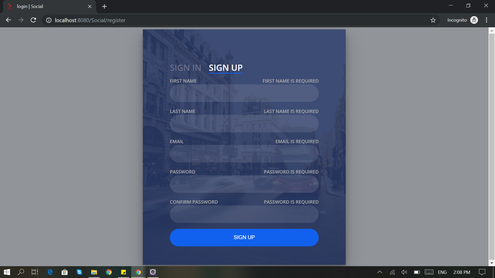
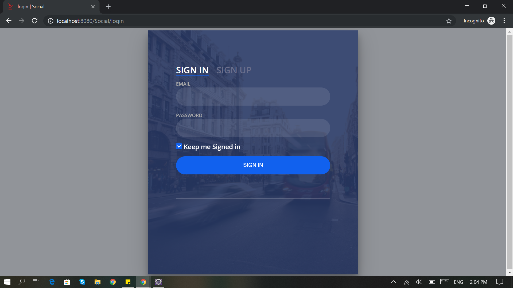
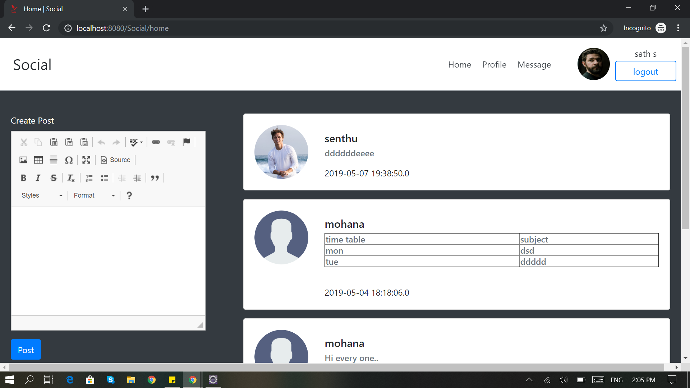
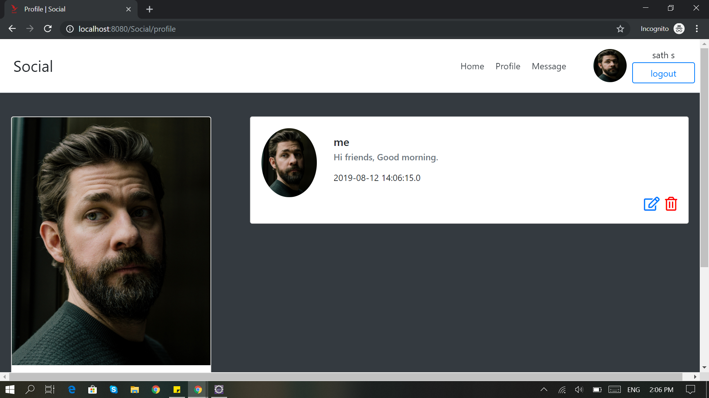
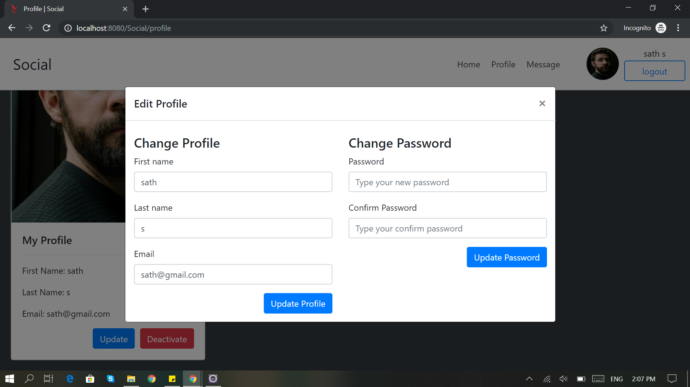
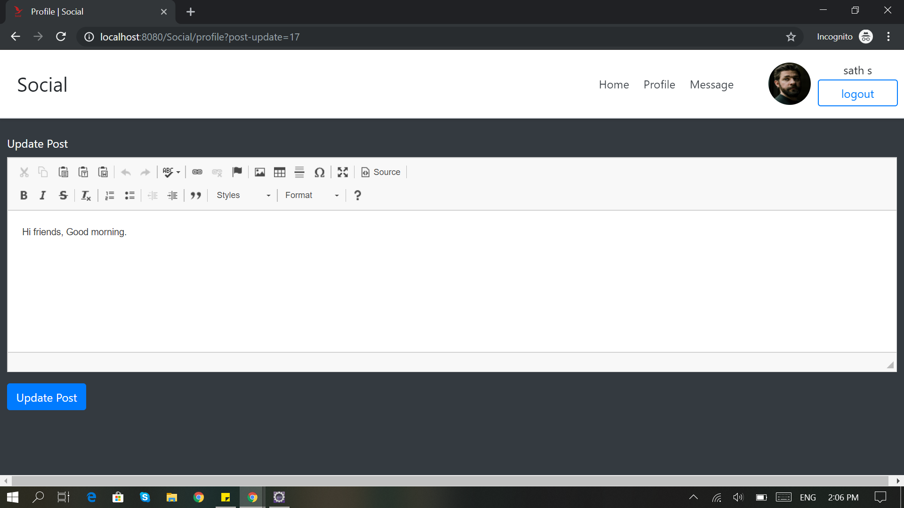
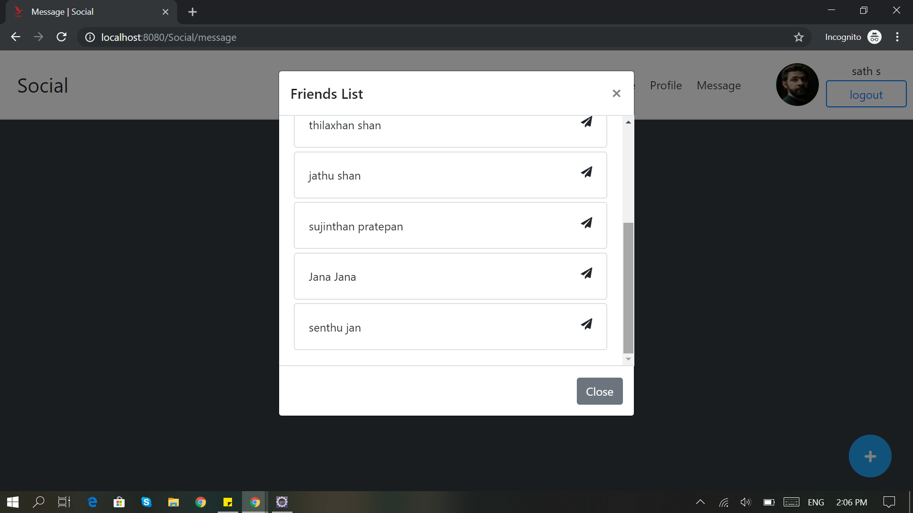
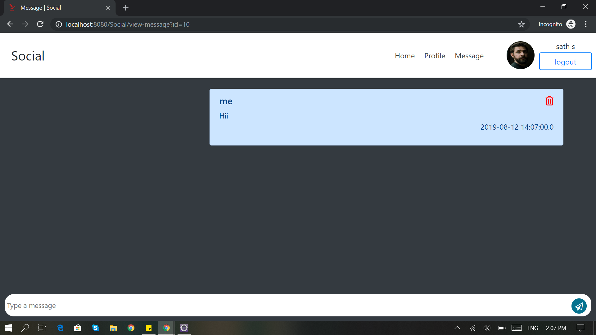
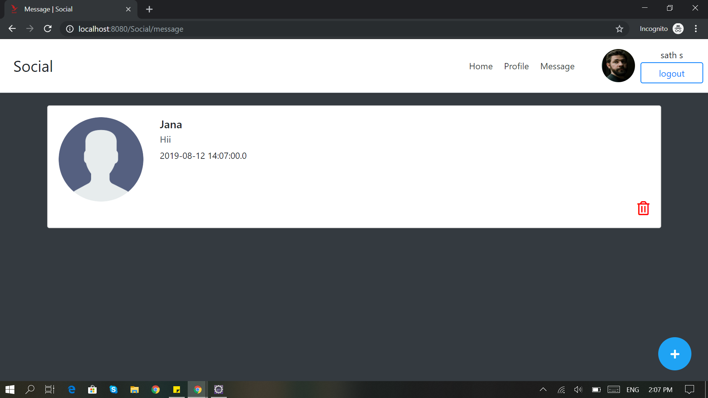

# Java EE Servlet API

> A servlet is a Java programming language class used to extend the capabilities of servers that host applications accessed
> by means of a request-response programming model. Although servlets can respond to any type of request, they are commonly
> used to extend the applications hosted by web servers. For such applications, Java Servlet technology defines HTTP-specific
> servlet classes.
>
> The `javax.servlet` and `javax.servlet.http` packages provide interfaces and classes for writing servlets. All servlets
> must implement the `Servlet` interface, which defines lifecycle methods. When implementing a generic service, you can
> use or extend the `GenericServlet` class provided with the Java Servlet API. The `HttpServlet` class provides methods,
> such as `doGet` and `doPost`, for handling HTTP-specific services.

[Oracle Servlet Tutorial](https://docs.oracle.com/javaee/7/tutorial/servlets001.htm)

## Project Description

This project builds a social media web application using JAVA EE Servlet API. It allows you to view friend's post and
profile, add and update own post, update own profile, and chat with friends.

### Running the application

Requires Java 8 update 442 `1.8.0_442`

1. Clone this repository
2. Use [`init_db.sql`](database/init_db.sql) script to seed a MySQL database running locally
3. Add your database connection settings to `DBConnection.java`
4. Run the application on Apache Tomcat server

If you have Docker, run `docker compose up` and visit `http://localhost:4000/demo/` in the browser.

### Screenshots

If everything is up and running properly, you should be able to use the following functionality:

#### Signup

#### Login

#### Home

#### Profile

#### Edit Profile

#### New Post

#### Friend List

#### Private Message

#### Message List

